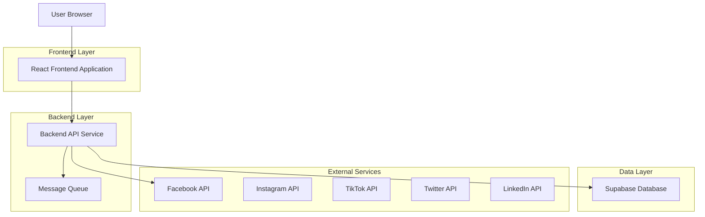
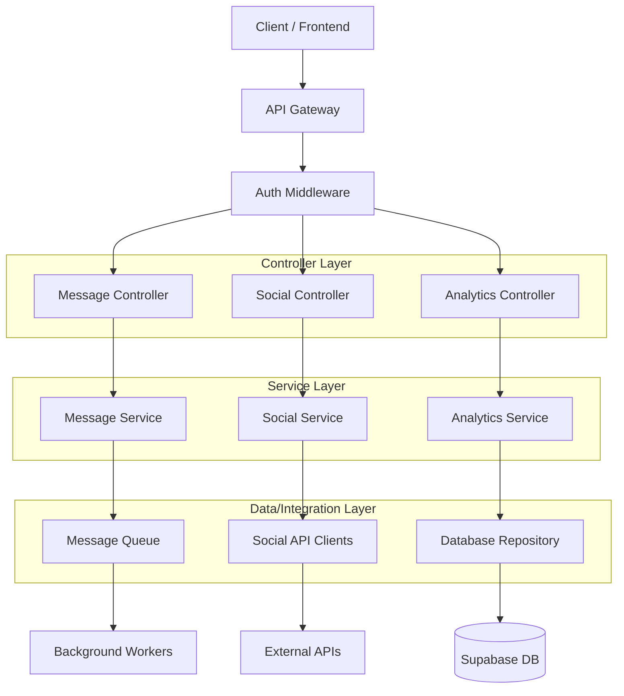
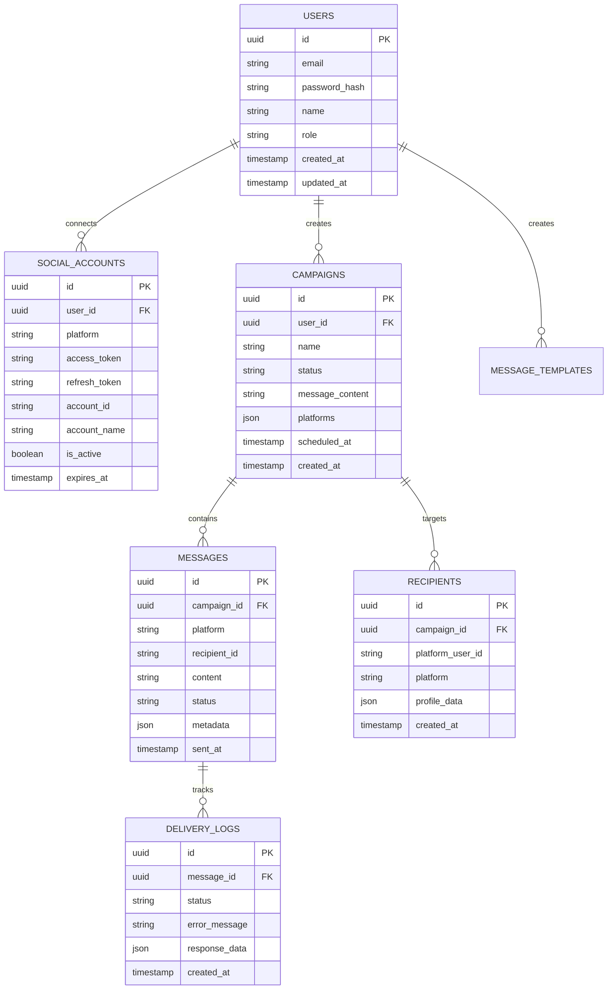

## 1. Architecture Design



## 2. Technology Description

* Frontend: React\@18 + tailwindcss\@3 + vite

* Backend: Node.js\@18 + Express\@4

* Database: Supabase (PostgreSQL)

* Message Queue: Redis + Bull Queue

* Authentication: Supabase Auth

* File Storage: Supabase Storage

## 3. Route Definitions

| Route             | Purpose                                      |
| ----------------- | -------------------------------------------- |
| /                 | Dashboard - Main overview and account status |
| /login            | User authentication and login                |
| /compose          | Message composition and platform selection   |
| /bulk-upload      | Recipient list management and CSV import     |
| /campaigns        | Campaign creation and management             |
| /analytics        | Performance metrics and reporting            |
| /settings         | Account settings and platform connections    |
| /api/auth/\*      | Authentication endpoints                     |
| /api/social/\*    | Social media platform integration            |
| /api/messages/\*  | Message sending and scheduling               |
| /api/analytics/\* | Analytics and reporting data                 |

## 4. API Definitions

### 4.1 Authentication APIs

```
POST /api/auth/login
```

Request:

| Param Name | Param Type | isRequired | Description        |
| ---------- | ---------- | ---------- | ------------------ |
| email      | string     | true       | User email address |
| password   | string     | true       | User password      |

Response:

| Param Name | Param Type | Description              |
| ---------- | ---------- | ------------------------ |
| token      | string     | JWT authentication token |
| user       | object     | User profile information |

### 4.2 Social Platform APIs

```
POST /api/social/connect
```

Request:

| Param Name    | Param Type | isRequired | Description          |
| ------------- | ---------- | ---------- | -------------------- |
| platform      | string     | true       | Social platform name |
| access\_token | string     | true       | OAuth access token   |

```
POST /api/messages/send-bulk
```

Request:

| Param Name     | Param Type | isRequired | Description           |
| -------------- | ---------- | ---------- | --------------------- |
| message        | string     | true       | Message content       |
| platforms      | array      | true       | Selected platforms    |
| recipients     | array      | true       | Recipient identifiers |
| schedule\_time | datetime   | false      | Optional scheduling   |

## 5. Server Architecture Diagram



## 6. Data Model

### 6.1 Data Model Definition



### 6.2 Data Definition Language

Users Table

```sql
CREATE TABLE users (
    id UUID PRIMARY KEY DEFAULT gen_random_uuid(),
    email VARCHAR(255) UNIQUE NOT NULL,
    password_hash VARCHAR(255) NOT NULL,
    name VARCHAR(100) NOT NULL,
    role VARCHAR(20) DEFAULT 'user' CHECK (role IN ('admin', 'user')),
    created_at TIMESTAMP WITH TIME ZONE DEFAULT NOW(),
    updated_at TIMESTAMP WITH TIME ZONE DEFAULT NOW()
);

-- Grant permissions
GRANT SELECT ON users TO anon;
GRANT ALL PRIVILEGES ON users TO authenticated;
```

Social Accounts Table

```sql
CREATE TABLE social_accounts (
    id UUID PRIMARY KEY DEFAULT gen_random_uuid(),
    user_id UUID REFERENCES users(id) ON DELETE CASCADE,
    platform VARCHAR(50) NOT NULL CHECK (platform IN ('facebook', 'instagram', 'tiktok', 'twitter', 'linkedin')),
    access_token TEXT NOT NULL,
    refresh_token TEXT,
    account_id VARCHAR(255) NOT NULL,
    account_name VARCHAR(255),
    is_active BOOLEAN DEFAULT true,
    expires_at TIMESTAMP WITH TIME ZONE,
    created_at TIMESTAMP WITH TIME ZONE DEFAULT NOW(),
    updated_at TIMESTAMP WITH TIME ZONE DEFAULT NOW()
);

CREATE INDEX idx_social_accounts_user_id ON social_accounts(user_id);
CREATE INDEX idx_social_accounts_platform ON social_accounts(platform);

GRANT SELECT ON social_accounts TO anon;
GRANT ALL PRIVILEGES ON social_accounts TO authenticated;
```

Campaigns Table

```sql
CREATE TABLE campaigns (
    id UUID PRIMARY KEY DEFAULT gen_random_uuid(),
    user_id UUID REFERENCES users(id) ON DELETE CASCADE,
    name VARCHAR(255) NOT NULL,
    status VARCHAR(50) DEFAULT 'draft' CHECK (status IN ('draft', 'scheduled', 'sending', 'completed', 'failed')),
    message_content TEXT NOT NULL,
    platforms JSONB NOT NULL,
    scheduled_at TIMESTAMP WITH TIME ZONE,
    created_at TIMESTAMP WITH TIME ZONE DEFAULT NOW(),
    updated_at TIMESTAMP WITH TIME ZONE DEFAULT NOW()
);

CREATE INDEX idx_campaigns_user_id ON campaigns(user_id);
CREATE INDEX idx_campaigns_status ON campaigns(status);

GRANT SELECT ON campaigns TO anon;
GRANT ALL PRIVILEGES ON campaigns TO authenticated;
```

Messages Table

```sql
CREATE TABLE messages (
    id UUID PRIMARY KEY DEFAULT gen_random_uuid(),
    campaign_id UUID REFERENCES campaigns(id) ON DELETE CASCADE,
    platform VARCHAR(50) NOT NULL,
    recipient_id VARCHAR(255) NOT NULL,
    content TEXT NOT NULL,
    status VARCHAR(50) DEFAULT 'pending' CHECK (status IN ('pending', 'sent', 'failed', 'delivered')),
    metadata JSONB,
    sent_at TIMESTAMP WITH TIME ZONE,
    created_at TIMESTAMP WITH TIME ZONE DEFAULT NOW()
);

CREATE INDEX idx_messages_campaign_id ON messages(campaign_id);
CREATE INDEX idx_messages_platform ON messages(platform);
CREATE INDEX idx_messages_status ON messages(status);

GRANT SELECT ON messages TO anon;
GRANT ALL PRIVILEGES ON messages TO authenticated;
```

