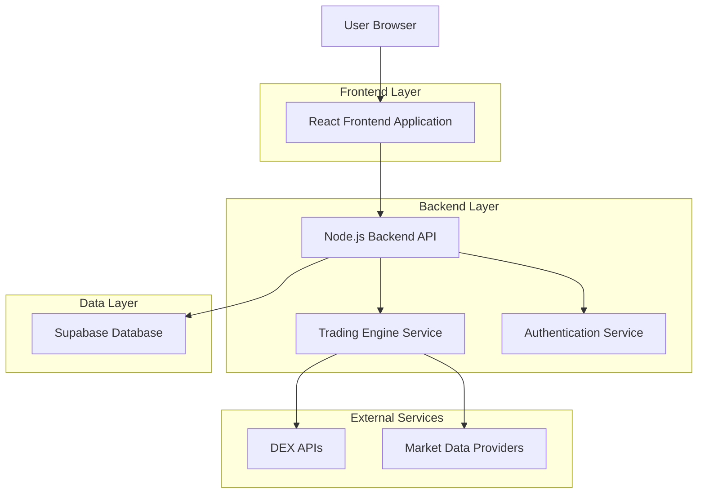
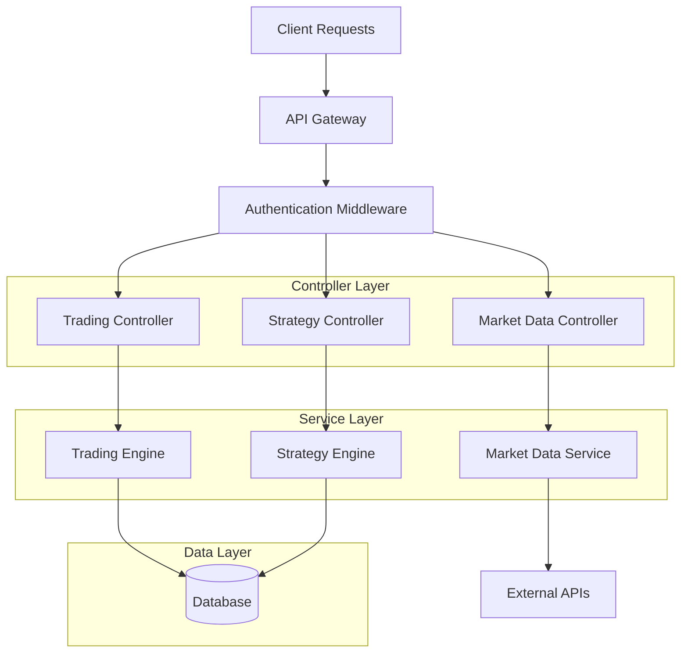
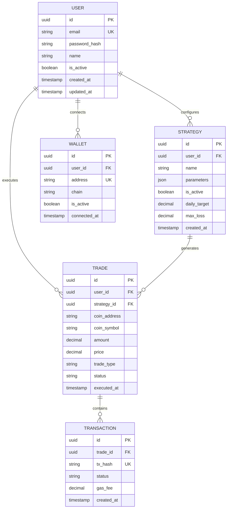

## 1. Architecture Design



## 2. Technology Description
- **Frontend**: React@18 + tailwindcss@3 + vite
- **Backend**: Node.js@18 + Express@4
- **Database**: Supabase (PostgreSQL)
- **Authentication**: Supabase Auth
- **Real-time Data**: WebSocket connections for live price updates

## 3. Route Definitions
| Route | Purpose |
|-------|---------|
| / | Dashboard with real-time trading overview |
| /login | User authentication page |
| /strategies | Trading strategy configuration interface |
| /analytics | Performance analytics and reporting |
| /wallets | Wallet management and connection settings |
| /settings | Application configuration and user preferences |

## 4. API Definitions

### 4.1 Authentication APIs
```
POST /api/auth/register
```
Request:
| Param Name | Param Type | isRequired | Description |
|------------|------------|------------|-------------|
| email | string | true | User email address |
| password | string | true | User password (min 8 characters) |
| name | string | true | User display name |

Response:
| Param Name | Param Type | Description |
|------------|------------|-------------|
| token | string | JWT authentication token |
| user | object | User profile data |

### 4.2 Trading APIs
```
POST /api/trades/execute
```
Request:
| Param Name | Param Type | isRequired | Description |
|------------|------------|------------|-------------|
| strategy_id | string | true | Strategy configuration ID |
| coin_address | string | true | Target coin contract address |
| amount | number | true | Trade amount in native currency |
| type | string | true | Trade type: 'buy' or 'sell' |

Response:
| Param Name | Param Type | Description |
|------------|------------|-------------|
| trade_id | string | Unique trade identifier |
| status | string | Trade execution status |
| tx_hash | string | Blockchain transaction hash |

### 4.3 Market Data APIs
```
GET /api/market/new-launches
```
Response:
| Param Name | Param Type | Description |
|------------|------------|-------------|
| launches | array | Array of newly launched coins |
| timestamp | string | Data timestamp |

## 5. Server Architecture Diagram



## 6. Data Model

### 6.1 Data Model Definition


### 6.2 Data Definition Language

User Table (users)
```sql
-- create table
CREATE TABLE users (
    id UUID PRIMARY KEY DEFAULT gen_random_uuid(),
    email VARCHAR(255) UNIQUE NOT NULL,
    password_hash VARCHAR(255) NOT NULL,
    name VARCHAR(100) NOT NULL,
    is_active BOOLEAN DEFAULT true,
    created_at TIMESTAMP WITH TIME ZONE DEFAULT NOW(),
    updated_at TIMESTAMP WITH TIME ZONE DEFAULT NOW()
);

-- create index
CREATE INDEX idx_users_email ON users(email);
```

Wallet Table (wallets)
```sql
-- create table
CREATE TABLE wallets (
    id UUID PRIMARY KEY DEFAULT gen_random_uuid(),
    user_id UUID REFERENCES users(id) ON DELETE CASCADE,
    address VARCHAR(255) NOT NULL,
    chain VARCHAR(50) NOT NULL,
    is_active BOOLEAN DEFAULT true,
    connected_at TIMESTAMP WITH TIME ZONE DEFAULT NOW(),
    UNIQUE(user_id, address)
);

-- create index
CREATE INDEX idx_wallets_user_id ON wallets(user_id);
CREATE INDEX idx_wallets_address ON wallets(address);
```

Strategy Table (strategies)
```sql
-- create table
CREATE TABLE strategies (
    id UUID PRIMARY KEY DEFAULT gen_random_uuid(),
    user_id UUID REFERENCES users(id) ON DELETE CASCADE,
    name VARCHAR(100) NOT NULL,
    parameters JSONB NOT NULL,
    is_active BOOLEAN DEFAULT true,
    daily_target DECIMAL(10,2) DEFAULT 0.00,
    max_loss DECIMAL(10,2) DEFAULT 0.00,
    created_at TIMESTAMP WITH TIME ZONE DEFAULT NOW(),
    updated_at TIMESTAMP WITH TIME ZONE DEFAULT NOW()
);

-- create index
CREATE INDEX idx_strategies_user_id ON strategies(user_id);
```

Trade Table (trades)
```sql
-- create table
CREATE TABLE trades (
    id UUID PRIMARY KEY DEFAULT gen_random_uuid(),
    user_id UUID REFERENCES users(id) ON DELETE CASCADE,
    strategy_id UUID REFERENCES strategies(id) ON DELETE CASCADE,
    coin_address VARCHAR(255) NOT NULL,
    coin_symbol VARCHAR(50) NOT NULL,
    amount DECIMAL(18,8) NOT NULL,
    price DECIMAL(18,8) NOT NULL,
    trade_type VARCHAR(10) NOT NULL CHECK (trade_type IN ('buy', 'sell')),
    status VARCHAR(20) NOT NULL DEFAULT 'pending',
    executed_at TIMESTAMP WITH TIME ZONE DEFAULT NOW()
);

-- create index
CREATE INDEX idx_trades_user_id ON trades(user_id);
CREATE INDEX idx_trades_strategy_id ON trades(strategy_id);
CREATE INDEX idx_trades_executed_at ON trades(executed_at DESC);
```

Transaction Table (transactions)
```sql
-- create table
CREATE TABLE transactions (
    id UUID PRIMARY KEY DEFAULT gen_random_uuid(),
    trade_id UUID REFERENCES trades(id) ON DELETE CASCADE,
    tx_hash VARCHAR(255) UNIQUE NOT NULL,
    status VARCHAR(20) NOT NULL DEFAULT 'pending',
    gas_fee DECIMAL(18,8) DEFAULT 0.00,
    created_at TIMESTAMP WITH TIME ZONE DEFAULT NOW()
);

-- create index
CREATE INDEX idx_transactions_trade_id ON transactions(trade_id);
CREATE INDEX idx_transactions_tx_hash ON transactions(tx_hash);
```

-- Grant permissions
GRANT SELECT ON users TO anon;
GRANT ALL PRIVILEGES ON users TO authenticated;
GRANT SELECT ON wallets TO anon;
GRANT ALL PRIVILEGES ON wallets TO authenticated;
GRANT SELECT ON strategies TO anon;
GRANT ALL PRIVILEGES ON strategies TO authenticated;
GRANT SELECT ON trades TO anon;
GRANT ALL PRIVILEGES ON trades TO authenticated;
GRANT SELECT ON transactions TO anon;
GRANT ALL PRIVILEGES ON transactions TO authenticated;